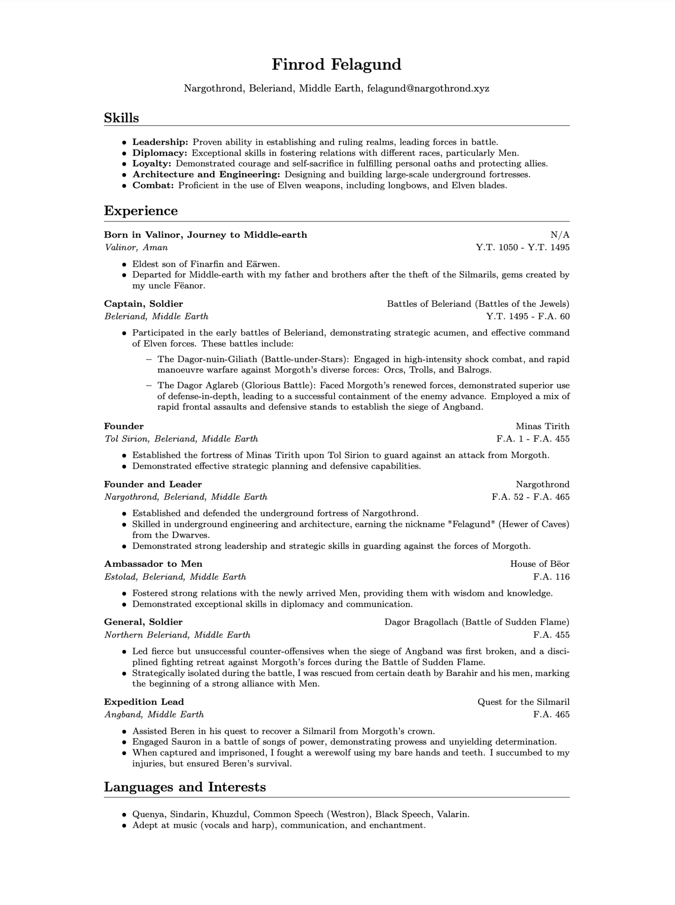

# nargothrond
My web(server/tools) [nargothrond.xyz](https://nargothrond.xyz/) & LaTeX templates.

  

> "Thus Finrod came to the Caverns of Narog, and began to establish there deep halls and armouries after the fashion of the mansions of Menegroth; and that stronghold was called Nargothrond."
> ― J.R.R. Tolkien, Quenta Silmarillion

#### LaTex
- [résumé](latex/resume.tex)

- [letter](latex/letter.tex)

