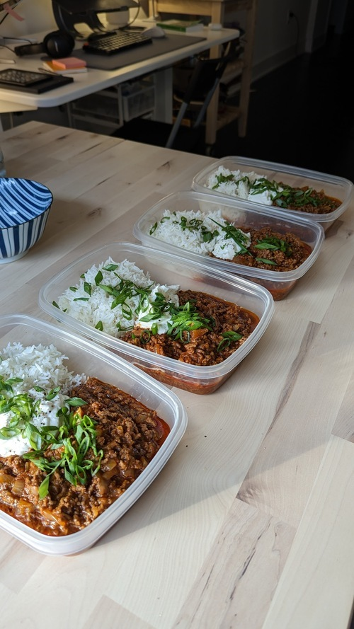

# Chili 

- **Serves**: 5
- **Prep time**: 1hr
- **Author**: Matthieu Court

## Ingredients
- 300g basmati rice
- 1kg lean beef mince 
- 2 - Brown Onions, Diced
- Small bunch - green onions
- 4ish - Garlic Cloves, Minced
- 2 Tbsp - Ground Cumin
- 1 tsp - Red Chilli Powder
- 3 tsp - Smoked Paprika
- 30ml - Apple Cider Vinegar
- 2 tsp - Brown Sugar
- 2 tsp - Allspice
- 4 Tbsp - Tomato Ketchup
- 3 tsp - Dijon Mustard
- 200g (7.05oz) - Concentrated Tomato Paste
- 300ml (300g) - Beef Stock
- Seasoning To Taste (Salt & Pepper)

## Steps
- Brown your beef mince and don't forget to crust it.
- Add the onion and green onion ends to the beef mince.
- Add cumin, chili powder, paprika, all spice and any other ground spices.
- Add tomato paste, ketchup, mustard, brown sugar, vinegar, then beef stock.
- Bring to a boil then reduce heat, and simmer for 30ish minutes.
- Prepare rice how you will.
- Add dollops of cream when serving.

