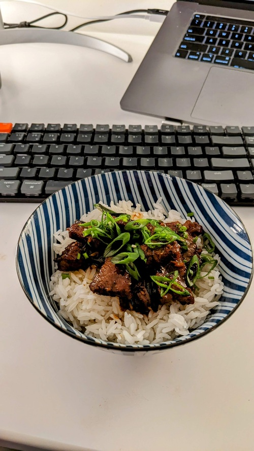

# Mongolian Beef

- **Serves**: 3
- **Prep time**: 1hr
- **Author**: Matthieu Court

## Ingredients
- 400-500g - Flank or Skirt Streak
- 3-4 Tbsp - Flour
- Handful - (Thai) Basil
- 3 - small Red Chilis
- 1/2 cup - Soy Sauce
- 30g - Brown Sugar
- 30g - Apple Cider Vinegar
- 1 bunch - Green Onion
- 4 cloves - Garlic (finely chopped)
