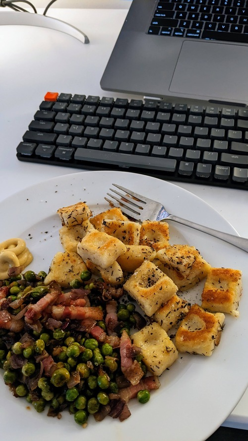

# Gnocchi Bowl

- **Serves**: 3
- **Prep time**: 1.5hr
- **Author**: Matthieu Court

## Ingredients
- 1 bunch - Russet potatoes (3)
- 1 cup - Flour.
- 1 handful - Pancetta or Lardons
- 1 tray - Frozen or fresh Peas
- 1 - Egg / cup of Flour
- Herbs - Fresh Thyme

## Steps
- Brown lardons, and heat up peas with them.
- Rice boiled potatoes, add salt, flour, some thyme, egg and flour and knead into dough.
- Form your gnocchi, blanch, then fry, adding some grated Parmigiano and lemon zest near the end.
