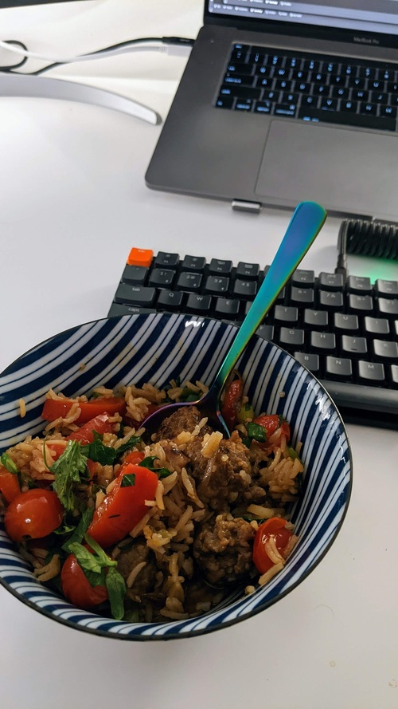

# Merguez Bowl 

- **Serves**: 4
- **Prep time**: 1hr
- **Author**: Matthieu Court

## Ingredients
- 1 cup -  Basmati Rice
- 8/9 Merguez or 5 Spicy Italian Sausages
- 1 - Red Onion (cut)
- 1 bunch - Parsley
- 1 - Bell Red Pepper (chopped)
- 5 - Cloves of Garlic (minced or finely chopped)
- 2 cups - Beef or Chicken Stock
- 1 big glass - Dry White Whine

## Steps
- Peel your sausages, and brown in sauteuse then reserve.
- Sauté peppers and onion, add garlic.
- Add meat, then add rice and blast it for 1 minute.
- Add wine and reduce.
- Add stock, bring to a boil, then simmer for 15 mins until rice is fluffy.
- Add chopped parsley shortly before serving.
