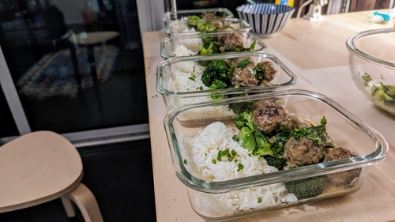

# Swedish Meatballs (Ikea)

- **Serves**: 5
- **Prep time**: 1hr
- **Author**: Matthieu Court

## Ingredients
- 800g - 50/50 Pork/Beef Mince
- 1/2 cup - Pank Crumbs
- 1 - Egg
- 1 - Onion (grated)
- Spices - Nutmeg, AllSpice, Black Pepper
- 1/2 cup - Heavy Cream or Condensed Milk
- Flour and Butter for Roux
- 2 cups - Beef Stock
- Herbs - Green Onion, Parsley, Chives
- Salt, Pepper (to taste)
